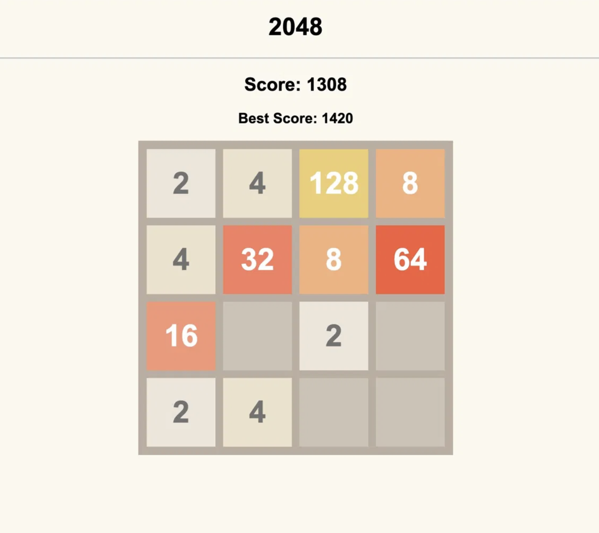

# 2048

A browser-based recreation of the classic 2048 puzzle game, built as a hands-on JavaScript learning project.

🎮 **[Play Live](https://emikatop.github.io/2048)**



## Features

- 4×4 sliding tile grid with merge logic
- Score tracker and persistent best score via localStorage
- Keyboard arrow key controls

## Built With

- HTML
- CSS
- JavaScript (DOM manipulation)

## Run Locally

No installation needed. Just clone the repo and open `index.html` in your browser:

```bash
git clone https://github.com/emikatop/2048.git
cd 2048
open index.html
```

## What I Learned

This was my first completed JavaScript project. I practiced DOM manipulation, game logic implementation, and persisting data with localStorage. I followed a tutorial but tried to understand what I'm coding. 
